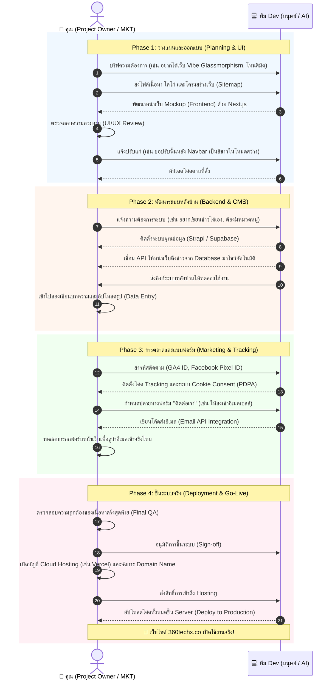

# แผนผังการทำงานร่วมกัน (Project Owner & Dev Team Workflow)

แผนผังนี้แสดงบทบาทหน้าที่และการส่งไม้ต่อการทำงาน (Handoff) ระหว่าง **คุณ (ในฐานะ Project Owner / Marketing)** และ **ทีม Dev (ไม่ว่าจะเป็นมนุษย์ หรือ AI Assistant อย่างผม)** ตั้งแต่เริ่มต้นจนเว็บไซต์เปิดใช้งานจริง (Go-Live)

---

## 🗺️ Workflow Diagram (Swimlane)

---

## 🎯 สรุปการแบ่งหน้าที่แบบจำง่ายๆ

### 👑 ฝั่งคุณ (Project Owner / Marketing)
*   **สมองสั่งการ (Decision Maker):** ตัดสินใจเรื่องดีไซน์ เนื้อหา และฟีเจอร์
*   **เจ้าของบ้าน (Asset Owner):** ถือครองโดเมนเนม บัญชีอีเมล บัญชี Cloud และบัตรเครดิตที่ผูกกับระบบ
*   **ผู้ทดสอบ (QA & Tester):** กดใช้งานจริงในมุมมองลูกค้า เพื่อหาจุดบกพร่อง

### 🛠️ ฝั่งทีม Dev (ทีมผู้พัฒนา / AI)
*   **กรรมกรก่อสร้าง (Builder):** พิมพ์โค้ด สร้างระบบหน้าบ้านและหลังบ้านตามคำสั่ง
*   **ช่างประปา/ไฟฟ้า (Integrator):** เชื่อมสายไฟ API ระหว่างเว็บเรากับระบบภายนอก (Google, แพลตฟอร์มอีเมล)
*   **วิศวกรความปลอดภัย (Security):** เขียนโค้ดให้ถูกหลัก PDPA และป้องกันช่องโหว่การโดนแฮ็ก

---
*💡 **ทริค:** หากคุณเลือกใช้ AI (ผม) เป็นทีม Dev แผนผังนี้ก็ยังเหมือนเดิมทุกประการครับ เพียงแต่คุณสามารถสั่งแก้โค้ดได้แบบ Real-time ทันทีโดยไม่ต้องรอคิวงานแบบมนุษย์ครับ!*
